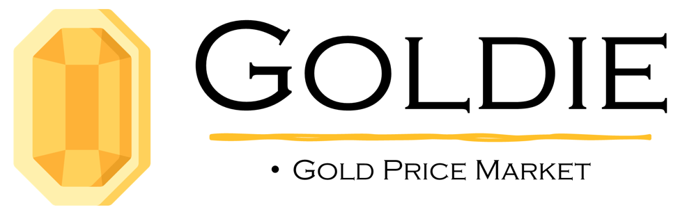
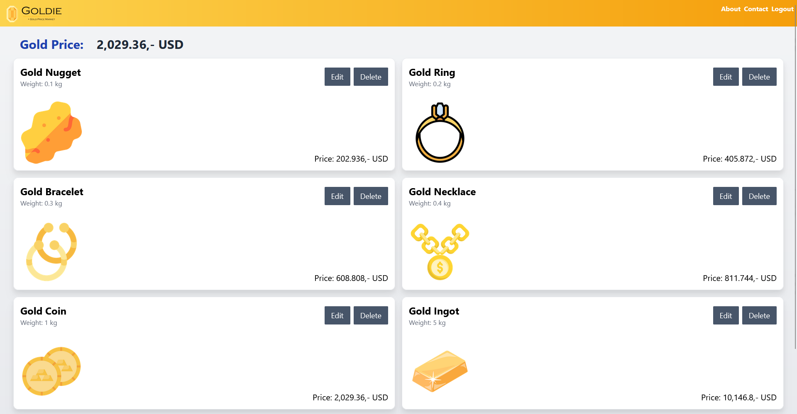

# Project Goldie
A web application to tell you goldprices based on common items.

### Preview


## Description
A web application to tell you goldprices based on common items.

## Setup

### Step 1: Install Dependencies
```
npm i
```

### Step 2: Setup .env variables
```
GOLD_API_KEY="TVCED7BFAJ1RTPDGGCJH706DGGCJH"
REDIS_KEY='Aad5ACQgYWRkMzliN2UtZDg2MS00YmZhLWI2Y2EtZTk3MmNiNmU2M2U2NzE5ODVjNjk1NjEwNDIwMGIyMTQxMzUwMDY3OTY1MGM='
```

### Step 3: Start the application
```
npm run dev
```